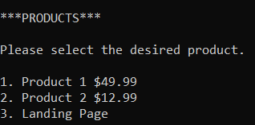

# Starting the program
To start the program run the “online\_retailer.py” script. This is the only script which needs to be run directly by the user to interface with the program.

The command line interface requires the user to input a number to navigate to the desired option. 

For example, on startup, you will be prompted to pick a security mode. Inputting 1 will turn security on, and inputting 2 will turn it off:

The security setting cannot be changed after startup, the program will need to be turned off and back on to switch to a different security mode.
# Signing up and logging in
After picking the security setting, you will be placed onto the landing page, which is the main page of the software. To make a new account, select the Sign Up option. You will be prompted to input a username and a password. With security mode off, the username must be between 6 and 20 characters long, but there are no other restrictions, and the password can be any length, even empty. With security mode on, the username may not include any of the following characters: =+-@,;'" or spaces/tabs, while the password requires 12+ characters, a lowercase letter, an uppercase letter, a digit, and one of the following special symbols: #?!@$%^&\*-

Once signed up successfully, the account credentials will be written to the secure or insecure CSV database, depending on the chosen security setting. These files are located within the database folder:

Following up, you must still log in even just after creating the account, by inputting the correct credentials. 
# User Features
Once the user has logged in, they will see this landing page:

Account settings will allow the user to change password (with the same conditions as when first setting it), add payment details, remove payment details:

Products will allow the user to browse products on the online retail store and purchase them:

In order for the user to purchase a product, they must first have inputted card details. This includes first and last name, card number (16 digits), expiration date (mm/yy), and CVC (3 digits). Once the purchase option is selected, the program will check if card details are available and allow purchase if so.
# Admin Features
The default admin account credentials are as follows:

USERNAME: Admin1

PASSWORD: Pas$w0rd12345

Once logged into an admin account, the User List option will be available in the landing page:

The admin will see a list of every user except for themselves (in order to prevent accidental deletion or demotion of own account).

Upon selection of user, there are the following options:

This allows the admin to delete, promote and demote accounts from being admin. Every account with admin privileges is equal and has access to these options, allowing them to delete, promote or demote any other account.

Finally, tests can be accessed by running the script within the “test” folder. This contains several unittests used to test key functionality of the application.

Please note that no scripts are used to perform any of the hacker attacks, and that evidence of their performance is included in the main report.

#Attacks

#Brute-Force attack

In order to perform a bruteforce attack, simply attempt multiple failed logins. In security mode, this will be prevented via strong passwords and a rate limit on failed login attempts.

#DoS attack

To perform a DoS attack, create accounts until there are 10 in the database, upon which it will be impossible for users to create more. This is prevented in security mode as only one account can be created per runtime.

#API Injection attack

In order to perform a formula injection, input a formula which can be ran in spreadsheet software such as Excel into the username or password field when creating account (password is better as it has no character limit). In secure mode, this is prevented, because passwords and card data are hashed, while usernames escape the characters which allow such formulas.
